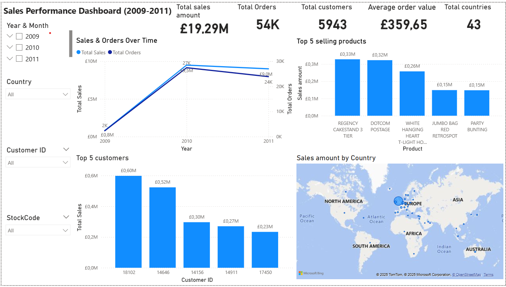

# 🛍️ Online Sales UK Dashboard (Power BI)

This Power BI project analyzes retail transaction data from the UK to uncover insights into sales trends, customer behavior, and product performance between 2009–2011.

---

## 📊 Dashboard Overview

The dashboard includes:  
- **KPI Cards**: Total Sales, Quantity Sold, Total Orders  
- **Line Chart**: Sales and Orders Over Time  
- **Bar Charts**: Top 5 Customers, Top Products by Quantity  
- **Map**: Sales by Country  
- **Slicers**: Date, Country, Customer ID, Invoice Number, Quantity Range  

---

## 🧠 Key Insights

- **United Kingdom** accounted for the majority of sales volume.  
- **Sales peaked** during specific months (e.g., Nov–Dec).  
- **Top 5 customers** contributed a significant percentage of revenue.  
- **Most sold products** were low-value, high-frequency items.  

---

## 📁 Files Included

| File Name                           | Description                              |
|-----------------------------------|------------------------------------------|
| `Online Sales UK store.pbix`       | Final Power BI dashboard file            |
| `OnlineRetail_2009-2011.csv.zip`   | Zipped CSV dataset (part 1)              |
| `OnlineRetail_2009-2011.2.csv.zip` | Zipped CSV dataset (part 2)              |
| `Snapshot.png`                     | Screenshot of final dashboard            |

---

## 📌 How to Use

1. Download the `.pbix` file and open it in Power BI Desktop.  
2. Extract the zipped CSV files if needed.  
3. Refresh data or explore filters and visuals as required.

---

## 📂 Dataset Source

[UCI Machine Learning Repository - Online Retail Dataset](https://archive.ics.uci.edu/ml/datasets/online+retail)

---

## 🔒 License

This project is licensed under the MIT License. See the `LICENSE` file for details.
